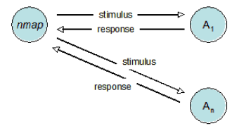
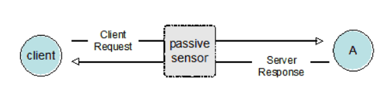

# Fingerprinting

Fingerprinting is the phase where the attacker moves from broad reconnaissance to specific technical profiling. It consists on a set of techniques to obtain the information provided by the machines in a network (hosts and network equipment) about running services, protocols, OS (with versions), and potential vulnerabilities (in software applications, operating system versions, configurations running on the target, etc.). An attacker constructs this "digital fingerprint" by analyzing the system's unique characteristics - whether by actively sending queries to interpret response behavior or by passively monitoring traffic patterns (such as TTL values and window sizes). This high-fidelity data allows the Red Team to map the attack surface and select precise exploits that match the identified versions, minimizing the risk of failed attacks.

It is crucial to understand the two approaches to Fingerprinting:

 

## Active Fingerprinting
Sending specially crafted packets (e.g., malformed TCP probes) to the target and analyzing the response. There's a direct communication with the target. Packets are sent and response is being analyzed. 

 

    

 

## Passive Fingerprinting
Sniffing network traffic without sending packets. There's no direct communication with the target because only the packets on the local network are being analyzed. 

 

    

 

---

 
 

## Fingerprinting Phases

The Fingerprinting stage is not a random execution of tools; it follows a strict logical sequence known as the "Funnel of Discovery." We must first find the door (Scanning), check if the lock is broken (Vulnerability Analysis), and finally peek inside (Enumeration):
 
 

## [1. Scanning](3.1-Tools.md#scanning)
This phase transitions from broad network ranges to specific targets. The objective is to determine the network topology, identify "Live" hosts within the CIDR blocks, and **map every listening service (Port) to create a comprehensive list of potential entry points**.

**Arsenal:** [Hping](3.1-Tools.md#hping), [Nmap](3.1-Tools.md#nmap), [UnicornScan](3.1-Tools.md#unicornscan), [Fping](3.1-Tools.md#fping), [ARPScan](3.1-Tools.md#arpscan), [Traceroute](3.1-Tools.md#traceroute), [Dnsenum](3.1-Tools.md#dnsenum), [airodump-ng](3.1-Tools.md#airodump-ng), [Wifite](3.1-Tools.md#wifite), [Wireshark](3.1-Tools.md#wireshark)

 

## [2. Vulnerability Analysis](3.1-Tools.md#vulnerability-analysis)
Once the services are mapped, we correlate their specific version numbers against known vulnerability databases (e.g., Exploit-DB). The goal is to identify CVEs (Common Vulnerabilities and Exposures) or misconfigurations that can be weaponized into a shell, prioritizing "Remote Code Execution" over low-impact bugs.

**Arsenal:** [Nessus](3.1-Tools.md#nessus), [OpenVAS](3.1-Tools.md#openvas), [Nikto](3.1-Tools.md#nikto), [SearchSploit](3.1-Tools.md#searchsploit)

 

## [3. Enumeration](3.1-Tools.md#enumeration)
This is the most intrusive and high-value pre-exploitation phase. Unlike scanning, enumeration asks "What data is inside?". We actively query the application logic to extract usernames, machine names, network shares, and routing tables, often utilizing the protocol's own features against itself.

**Arsenal:** [Telnet](3.1-Tools.md#telnet), [Netcat](3.1-Tools.md#netcat), [Nmap](3.1-Tools.md#nmap-enum), [Nbtscan](3.1-Tools.md#nbtscan), [Enum4linux](3.1-Tools.md#enum4linux), [Dig](3.1-Tools.md#dig), [Snmp-check](3.1-Tools.md#snmp-check), [Smtp-user-enum](3.1-Tools.md#smtp-user-enum), [Wappalyzer](3.1-Tools.md#wappalyzer)

 

---

 
 

| Previous Page | Next Page |
|:-------------------------------------------:|:---------------------------------------------:|
| [Footprinting Tools](../2-Footprinting/2.1-Tools.md) | [Fingerprinting Tools](../3-Fingerprinting/3.1-Tools.md) |

