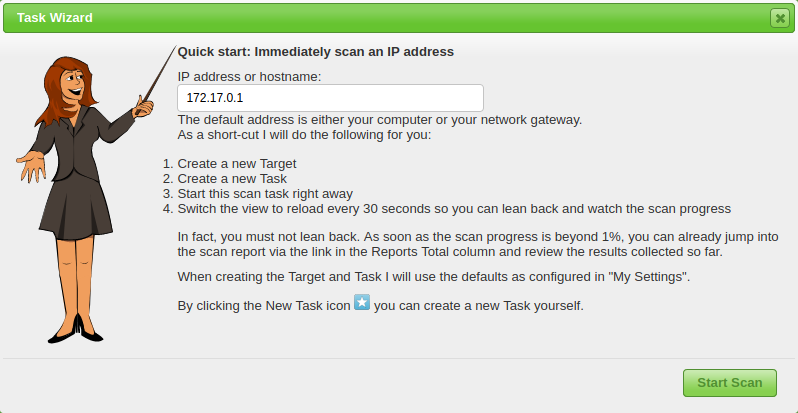

<div align="center">

| Previous Page | Next Phase |
|:-------------------------------------------:|:---------------------------------------------:|
| [Fingerprinting Page](/3-Fingerprinting/3.0-Fingerprinting.md) | [Exploitation](../4-Exploitation/4.0-Exploitation.md) |

</div>

<br>


# Scanning

<br>

<p align=center>

| Tool | Category | Scanning Technique | Purpose | Link |
|:-----|:---------|:-------------------|:--------|:-----|
| [**Hping**](#hping) | **Active Scanning** | **Ping Sweep** | Advanced TCP/IP packet crafting & firewall testing | [GitHub](https://github.com/antirez/hping) |
| [**Nmap**](#nmap) | **Active Scanning** | **Ping Sweep** | Network mapping, port scanning, service/OS detection | [nmap.org](https://nmap.org/) |
| [**UnicornScan**](#unicornscan) | **Active Scanning** | **Ping Sweep** | High-performance asynchronous port scanner | [GitHub]( https://github.com/robertelee78/unicornscan) |
| [**Fping**](#fping) | **Active Scanning** | **Ping Sweep** | Fast ICMP ping sweeps for host discovery | [fping.org](https://www.fping.org/) |
| [**ARPScan**](#arpscan) | **Active Scanning** | **ARP Sweep** | Discover hosts via ARP requests (Local Network) | [GitHub](https://github.com/royhills/arp-scan) |
| [**Traceroute**](#traceroute) | **Active Scanning** | **Traceroute** | Trace network path and hops to target | Built-in |
| [**Dnsenum**](#dnsenum) | **Active Scanning** | **DNS Enumeration** | DNS brute-forcing and zone transfer attempts | [GitHub](https://github.com/fwaeytens/dnsenum) |
| [**airodump-ng**](#airodump-ng) | **Passive Scanning** | **War Driving** | Wi-Fi network capture & analysis (Monitor Mode) | [aircrack-ng.org](https://www.aircrack-ng.org/) |
| [**Wifite**](#wifite) | **Active Scanning** | **War Driving** | Automated Wi-Fi attack suite (De-auth/Injection) | [GitHub](https://github.com/derv82/wifite2) |
| [**Wireshark**](#wireshark) | **Passive Scanning** | **Packet Sniffing** | Deep packet analysis & passive host discovery | [wireshark.org](https://www.wireshark.org/) |

</p>

<br>

## Hping
> * *HomePage: https://github.com/antirez/hping*
> * *Installation Guide: https://github.com/antirez/hping/blob/master/INSTALL*

<br>

Hping is a command-line TCP/IP packet assembler and analyzer. It is used for firewall testing, advanced network scanning, and crafting custom packets (TCP, UDP, ICMP, RAW-IP).


#### Cheat Sheet
| Option | Description | Example |
|:-------|:------------|:--------|
| `-S` | TCP SYN scan | `hping3 -S -p 80 target.com` |
| `-A` | TCP ACK scan | `hping3 -A -p 80 target.com` |
| `-1` | ICMP mode (ping) | `hping3 -1 target.com` |
| `-8` | Scan mode (port range) | `hping3 -8 1-1000 target.com` |
| `-c` | Packet count | `-c 5` |
| `-p` | Target port | `-p 80` |

#### Practical Usage
```bash
# SYN scan (like Nmap stealth scan)
hping3 -S -p 80 -c 3 target.com
# ICMP ping
gping3 -1 -c 3 target.com
# Port range scan
hping3 -8 20-25 target.com
```

<br>

## Nmap
> *HomePage: https://nmap.org/*

<p align="center">
    
</p>

> *Installation Guide: https://nmap.org/download.html*

Nmap ("Network Mapper") is the industry-standard open-source tool for network discovery and security auditing. It uses raw IP packets to determine available hosts, services, operating systems, firewalls, and countless other characteristics.


#### Use Cases for Red Team

<p align="center">

| Use Case | What to Look For |
|:---------|:-----------------|
| **Host Discovery** | - Live hosts in IP ranges<br> - Responsive systems behind firewalls<br> - Hidden hosts via different probe types |
| **Port Scanning** | - Open TCP/UDP ports<br> - Filtered vs closed ports<br> - Service states |
| **Service Detection** | - Service versions (Apache 2.4.29, OpenSSH 7.6)<br> - Application fingerprints<br> - Banner information |
| **OS Detection** | - Operating system type and version<br> - Kernel versions<br> - Device types |
| **Vulnerability Scanning** | - NSE scripts for CVE detection<br> - Default credentials<br> - Misconfigurations |

</p>

#### Nmap Cheat Sheet

<p align="center">

| Option | Description | Example |
|:-------|:------------|:--------|
| `-sn` | Ping scan (host discovery only) | `nmap -sn 192.168.1.0/24` |
| `-sS` | TCP SYN scan (stealth) | `nmap -sS 192.168.1.1` |
| `-sT` | TCP connect scan (full handshake) | `nmap -sT 192.168.1.1` |
| `-sU` | UDP scan | `nmap -sU 192.168.1.1` |
| `-sV` | Service version detection | `nmap -sV 192.168.1.1` |
| `-O` | OS detection | `nmap -O 192.168.1.1` |
| `-A` | Aggressive scan (OS + version + scripts + traceroute) | `nmap -A 192.168.1.1` |
| `-p` | Specify ports | `nmap -p 22,80,443` or `-p-` (all) |
| `--top-ports` | Scan N most common ports | `nmap --top-ports 1000` |
| `-T<0-5>` | Timing template (0=paranoid, 5=insane) | `nmap -T4 192.168.1.1` |
| `-Pn` | Skip host discovery (treat all as online) | `nmap -Pn 192.168.1.1` |
| `--script` | Run NSE scripts | `nmap --script vuln` |
| `-oN/-oX/-oG` | Output: Normal/XML/Grepable | `nmap -oN scan.txt` |

</p>

#### Practical Usage

```bash
# ========================================= #
#            HOST DISCOVERY                 #
# ========================================= #

# == Ping sweep (find live hosts) == #
nmap -sn 192.168.1.0/24

# == ARP discovery (local network) == #
nmap -PR 192.168.1.0/24

# == Discovery when ICMP is blocked == #
nmap -PS22,80,443 192.168.1.0/24    # TCP SYN discovery
nmap -PA80,443 192.168.1.0/24       # TCP ACK discovery

# ========================================= #
#             PORT SCANNING                 #
# ========================================= #

# == Quick scan (top 1000 ports) == #
nmap 192.168.1.1

# == Full port scan == #
nmap -p- 192.168.1.1

# == Specific ports == #
nmap -p 21,22,80,443,445,3389 192.168.1.1

# == UDP scan (common services) == #
sudo nmap -sU --top-ports 100 192.168.1.1

# ========================================= #
#          SERVICE ENUMERATION              #
# ========================================= #

# == Service version detection == #
nmap -sV 192.168.1.100

# == Version + default scripts == #
nmap -sV -sC 192.168.1.100

# == Aggressive enumeration == #
nmap -A -p- 192.168.1.100

# == SNMP enumeration == #
nmap -sU -p 161 --script snmp-* 192.168.1.100

# == SMB enumeration == #
nmap -p 445 --script smb-enum-* 192.168.1.100

# == DNS enumeration == #
nmap -p 53 --script dns-* target.com

# == HTTP enumeration == #
nmap -p 80,443 --script http-enum,http-headers target.com

# == Stealth service detection == #
nmap -sV -sS -T2 192.168.1.100

# ========================================= #
#         VULNERABILITY SCANNING            #
# ========================================= #

# == Run vuln scripts == #
nmap --script vuln 192.168.1.1

# == Specific vulnerability check == #
nmap --script smb-vuln-ms17-010 192.168.1.1   # EternalBlue
nmap --script http-shellshock 192.168.1.1     # Shellshock

# == Safe scripts only == #
nmap --script "safe" 192.168.1.1

# ========================================= #
#           EVASION TECHNIQUES              #
# ========================================= #

# == Slow scan (IDS evasion) == #
nmap -T0 192.168.1.1

# == Fragment packets == #
nmap -f 192.168.1.1

# == Decoy scan == #
nmap -D RND:10 192.168.1.1

# == Spoof source port == #
nmap --source-port 53 192.168.1.1

# ========================================= #
#           OUTPUT FORMATS                  #
# ========================================= #

# == Save all formats == #
nmap -oA full_scan 192.168.1.1

# == Grepable output (for scripting) == #
nmap -oG - 192.168.1.0/24 | grep "open"
```

<br>

## UnicornScan
> *Installation Guide:  https://github.com/robertelee78/unicornscan*

UnicornScan is a high-performance, asynchronous network port scanner designed for large-scale and stealthy scanning.

#### Installation
```bash
sudo apt update
sudo apt install unicornscan
```

#### Cheat Sheet
| Option | Description | Example |
|:-------|:------------|:--------|
| `-Iv` | Interactive verbose mode | `unicornscan -Iv 192.168.1.0/24:a` |
| `-p` | Specify port(s) | `-p 80,443` |
| `:a` | TCP SYN scan | `192.168.1.0/24:a` |
| `:b` | TCP connect scan | `192.168.1.0/24:b` |
| `:U` | UDP scan | `192.168.1.0/24:U` |

#### Practical Usage
```bash
# TCP SYN scan on subnet
unicornscan -Iv 192.168.1.0/24:a
# UDP scan on port 53
unicornscan -Iv -p 53 192.168.1.0/24:U
```

<br>

## Fping
> *Installation Guide: https://www.fping.org/*

Fping is a fast ICMP ping sweep tool for discovering live hosts in large networks.


#### Cheat Sheet
| Option | Description | Example |
|:-------|:------------|:--------|
| `-a` | Show alive hosts only | `fping -a -g 192.168.1.0/24` |
| `-g` | Generate IP range | `-g 10.0.0.1 10.0.0.254` |
| `-f` | Read targets from file | `-f targets.txt` |
| `-r` | Retries per host | `-r 2` |
| `-t` | Timeout (ms) | `-t 100` |

#### Practical Usage
```bash
# Sweep a subnet for live hosts
fping -a -g 192.168.1.0/24
# Sweep from file
fping -a -f targets.txt
```

<br>

## ARPScan
> *Installation Guide: https://github.com/royhills/arp-scan*

ARPScan discovers hosts on a local network by sending ARP requests. It is effective for finding devices that block ICMP or are not listed in DNS.

#### Cheat Sheet
| Option | Description | Example |
|:-------|:------------|:--------|
| `-I` | Interface | `-I eth0` |
| `-l` | Local network | `-l` |
| `-g` | Use default gateway | `-g` |
| `-r` | Retries | `-r 2` |
| `-x` | Output in XML | `-x` |

#### Practical Usage
```bash
# Scan local subnet
sudo arp-scan -l
# Scan specific range
sudo arp-scan 192.168.1.0/24
```

<br>

## Traceroute
Traceroute maps the path packets take to a network host, revealing intermediate routers and network topology.


#### Cheat Sheet
| Option | Description | Example |
|:-------|:------------|:--------|
| `-n` | Do not resolve hostnames | `traceroute -n target.com` |
| `-I` | Use ICMP ECHO | `traceroute -I target.com` |
| `-T` | Use TCP SYN | `sudo traceroute -T target.com` |
| `-p` | Destination port | `-p 443` |
| `-m` | Max hops | `-m 50` |

#### Practical Usage
```bash
# Standard trace
traceroute target.com
# Fast trace (no DNS)
traceroute -n target.com
# TCP SYN trace
sudo traceroute -T -p 443 target.com
```

<br>

## Dnsenum
> *Installation Guide: https://github.com/SparrowOchon/dnsenum2*

Dnsenum is a multithreaded perl script to enumerate DNS information of a domain and to discover non-contiguous ip blocks.


#### Cheat Sheet
| Option | Description | Example |
|:-------|:------------|:--------|
| `<domain>` | Target domain | `dnsenum target.com` |
| `--enum` | Full enumeration | `dnsenum --enum target.com` |
| `-f` | Subdomain wordlist | `-f subdomains.txt` |
| `--threads` | Number of threads | `--threads 10` |
| `-o` | Output file | `-o results.xml` |

#### Practical Usage
```bash
# Quick scan
dnsenum target.com
# Brute-force with wordlist
dnsenum -f subdomains.txt --threads 10 target.com
# Save results
dnsenum --enum -o report.xml target.com
```

<br>

## airodump-ng
> *HomePage: https://www.aircrack-ng.org/*

<p align="center">
    
</p>

Powerful wireless packet capture tool, part of the Aircrack-ng suite. It is used for scanning and monitoring Wi-Fi networks, capturing raw 802.11 frames, identifying access points (APs), clients, and collecting handshakes for WPA/WPA2 cracking. Essential for wireless network reconnaissance and pre-attack mapping.
> *Installation Guide: https://www.aircrack-ng.org/doku.php?id=install_aircrack*

#### Cheat Sheet
| Option | Description | Example |
|:-------|:------------|:--------|
| `-i` | Wireless interface (in monitor mode) | `-i wlan0mon` |
| `-w` | Write captured packets to file | `-w capture.cap` |
| `--bssid` | Filter by AP MAC address | `--bssid 00:11:22:33:44:55` |
| `--channel` | Filter by channel | `--channel 6` |
| `--write-interval` | Set file write interval (seconds) | `--write-interval 5` |

#### Practical Usage
```bash
# 1. List wireless interfaces and enable monitor mode
sudo airmon-ng
sudo airmon-ng start wlan0

# 2. Scan all Wi-Fi networks and clients (basic discovery)
sudo airodump-ng wlan0mon

# 3. Focus on a specific channel for less noise (e.g., channel 6)
sudo airodump-ng --channel 6 wlan0mon

# 4. Target a specific AP (capture handshakes for WPA/WPA2 cracking)
sudo airodump-ng --bssid 00:11:22:33:44:55 --channel 6 -w handshakes wlan0mon

# 5. Save output in CSV, Kismet, and pcap formats for later analysis
sudo airodump-ng --write-interval 5 -w results --output-format csv,kismet,pcap wlan0mon

# 6. Filter by client MAC (track a specific device)
sudo airodump-ng --bssid 00:11:22:33:44:55 --channel 6 --station AA:BB:CC:DD:EE:FF -w client_capture wlan0mon

# 7. Combine with aireplay-ng for deauth attack (to force handshake capture)
sudo aireplay-ng --deauth 10 -a 00:11:22:33:44:55 wlan0mon
# Then run airodump-ng as above to capture the handshake
```

<br>

## Wifite
> *Installation Guide: https://github.com/kimocoder/wifite2*

wifite is an automated wireless attack tool for auditing WPA/WPA2 and WEP networks. It automates the process of capturing handshakes and launching attacks.

#### Installation
```bash
sudo apt update
sudo apt install wifite
```

#### Cheat Sheet
| Option | Description | Example |
|:-------|:------------|:--------|
| `-i` | Wireless interface | `-i wlan0` |
| `--kill` | Kill interfering processes | `--kill` |
| `--wps` | Target WPS networks | `--wps` |
| `--wep` | Target WEP networks | `--wep` |
| `--wpa` | Target WPA networks | `--wpa` |
| `-v` | Verbose output | `-v` |

#### Practical Usage
```bash
# Start automated attack
sudo wifite
# Specify interface and kill processes
sudo wifite -i wlan0 --kill
# Only attack WPA networks
sudo wifite --wpa
```

<br>

## Wireshark
> *HomePage: https://www.wireshark.org/*

Wireshark is the world's most widely used network protocol analyzer. In a Red Team context, it is used for **Passive Scanning** - discovering hosts and services by listening to broadcast traffic (ARP, DHCP, STP) without sending a single packet. It is also essential for debugging why an exploit failed or extracting cleartext credentials from captured traffic.

#### Use Cases for Red Team

<p align="center">

| Use Case | What to Look For |
|:---------|:-----------------|
| **Passive Discovery** | - **ARP Requests:** Reveal IP-to-MAC mappings of live hosts.<br>- **DHCP traffic:** Reveals new hosts joining the network.<br>- **NBNS/MDNS:** reveals Windows hostnames and printers. |
| **Credential Sniffing** | - **Telnet/FTP/HTTP:** Cleartext passwords.<br>- **SNMP:** Community strings.<br>- **Basic Auth:** Base64 encoded headers. |
| **Troubleshooting** | - **TCP Retransmissions:** Firewall blocking connection?<br>- **ICMP Unreachable:** Host down or filtered? |

</p>

#### Wireshark Display Filters Cheat Sheet

<p align="center">

| Filter | Description | Example |
|:-------|:------------|:--------|
| `ip.addr == X` | Filter by specific IP (Src or Dst) | `ip.addr == 192.168.1.5` |
| `ip.src == X` | Filter by Source IP only | `ip.src == 192.168.1.100` |
| `tcp.port == X` | Filter by TCP Port | `tcp.port == 80` |
| `http.request.method == "POST"` | Find HTTP POST login attempts | `http.request.method == "POST"` |
| `arp` | Show only ARP traffic (Host Discovery) | `arp` |
| `bootp` | Show DHCP traffic (New clients) | `bootp` |
| `dns` | Show DNS queries (Enumeration) | `dns` |
| `tcp.flags.syn == 1` | Show TCP SYN packets (Scan attempts) | `tcp.flags.syn == 1 and tcp.flags.ack == 0` |
| `frame contains "pass"` | Search packet content for string | `frame contains "admin"` |

</p>

#### Practical Usage

**1. Passive Host Discovery (The "Silent" Map)**
Instead of running a noisy `nmap -sn`, open Wireshark and filter for `arp`.
* **Action:** Wait 5-10 minutes.
* **Result:** You will see "Who has 192.168.1.X? Tell 192.168.1.Y". Every IP listed is a live host on the subnet.

**2. Extracting Credentials (Telnet/FTP)**
If you are on a hub or performing a Man-in-the-Middle attack:
* **Filter:** `telnet || ftp || http.auth`
* **Action:** Right-click a packet $\rightarrow$ **Follow TCP Stream**.
* **Result:** You see the full conversation: `Login: admin`, `Password: 123456`.

**3. TShark (Command Line Wireshark)**
Useful when you only have a terminal (SSH session).

```bash
# == Capture traffic on eth0 and save to file == #
sudo tshark -i eth0 -w capture.pcap

# == Read a pcap file and filter for HTTP POST requests == #
tshark -r capture.pcap -Y "http.request.method == POST"

# == Live sniff for DNS queries == #
sudo tshark -i eth0 -f "udp port 53"
```

<!--
===========================================================
                    VULNERABILITY ANALYSIS
===========================================================
-->

<br>
<br>

# Vulnerability Analysis

<br>

<p align="center">

| Tool | Category | Purpose | Link |
|:-----|:---------|:--------|:-----|
| [**Nessus**](#nessus) | Active Scanning | Comprehensive Vulnerability Scanner (Industry Standard) | [tenable.com](https://www.tenable.com/products/nessus) |
| [**OpenVAS**](#openvas) | Active Scanning | Open-Source Vulnerability Scanner (Free alternative) | [openvas.org](https://www.openvas.org/) |
| [**Nikto**](#nikto) | Active Scanning | Scans web servers for dangerous files/CGIs and outdated software | [cirt.net](https://cirt.net/Nikto2) |
| [**SearchSploit**](#searchsploit) | Passive Scanning | Offline command-line search for Exploit-DB (Verifying CVEs) | [exploit-db.com](https://www.exploit-db.com/searchsploit) |

</p>

<br>

## Nessus
> *Installation Guide: https://docs.tenable.com/nessus/Content/GettingStarted.htm*

Nessus is a tool that uses techniques similar to Nmap to find and report vulnerabilities, which are then, presented in a nice GUI for us to look at. Nessus is different from other scanners as it doesn't make assumptions when scanning, like assuming the web application is running on port 80 for instance.


#### Use Cases for Red Team

<p align="center">

| Use Case | What to Look For |
|:---------|:-----------------|
| **Vulnerability Discovery** | - CVEs affecting discovered services<br> - Exploitable flaws with public exploits<br> - Critical/High severity findings |
| **Misconfiguration Detection** | - Default credentials<br> - Weak encryption<br> - Unnecessary services |
| **Compliance Checking** | - PCI DSS, HIPAA, CIS benchmarks<br> - Security policy violations |
| **Patch Assessment** | - Missing security updates<br> - End-of-life software<br> - Outdated versions |

</p>

#### Practical Usage

```bash
# ========================================= #
#            SCAN WORKFLOW                  #
# ========================================= #

# 1. Create New Scan > Basic Network Scan
# 2. Enter target IPs/ranges
# 3. Configure credentials (optional - for authenticated scans)
# 4. Launch scan

# ========================================= #
#          SCAN TYPES TO USE                #
# ========================================= #

# == Basic Network Scan == #
# - Quick discovery and vuln assessment
# - Good for initial reconnaissance

# == Advanced Scan == #
# - Customizable plugins
# - Enable specific CVE checks

# == Credentialed Scan == #
# - Add SSH/WMI credentials
# - Much deeper vulnerability detection
# - Finds missing patches, local misconfigs

# ========================================= #
#         RESULTS ANALYSIS                  #
# ========================================= #

# Priority for Red Team:
# 1. Critical/High findings with "Exploit Available"
# 2. Default credentials detected
# 3. Remote Code Execution vulnerabilities
# 4. Authentication bypass issues

# Export options:
# - HTML for reporting
# - CSV for parsing
# - Nessus format for re-import
```

<br>

## OpenVAS
> *Installation Guide: https://github.com/greenbone/openvas-scanner/blob/master/INSTALL.md*

OpenVAS, an application used to scan endpoints and web applications to identify and detect vulnerabilities. It is commonly used by corporations as part of their mitigation solutions to quickly identify any gaps in their production or even development servers or applications. This is not an end all be all solution but can help to get rid of any common vulnerabilities that may have slipped through the cracks.  From the OpenVAS GitHub repository "This is the Open Vulnerability Assessment Scanner (OpenVAS) of the Greenbone Vulnerability Management (GVM) Solution. It is used for the Greenbone Security Manager appliances and is a full-featured scan engine that executes a continuously updated and extended feed of Network Vulnerability Tests (NVTs)."

> Default credentials to access OpenVAS/GVM:
> - Username: admin
> - Password: admin

<br>

### Initial Configuration

Before we can start scanning and implementing OpenVAS into our vulnerability management solution we need to do a little bit of maintenance and configuration to get OpenVAS properly working. Luckily for us, OpenVAS makes the process very easy and includes a wizard to make the process straightforward. 

Begin by navigating to Scans > Tasks and clicking on the purple magic wand icon to begin the basic configuration wizard. We recommend beginning a scan on 127.0.0.1 to test out your installation and ensure it is working properly.

<p align="center">
    
</p>

If you successfully navigated to the wizard you should see a pop-up similar to the one above. This is where you will set up your initial scan against your localhost to ensure everything is properly configured.

The scan may take a while to complete, allow OpenVAS enough time to finish the scan, and then you will be met with a new dashboard for monitoring and analyzing your complete and ongoing scans like the one below.

Once your scan has finished you can navigate to Scans > Reports and click on your newly created report.

<br>

### Creating a Task

To create a configurable task navigate to the star icon in the upper right-hand corner of the Tasks dashboard and select New Task. 


> * Name: Allows us to set the name the scan will be known as inside of OpenVAS
> * Scan Targets: The targets to scan, can include Hosts, Ports, and Credentials. To create a new target you will need to follow another pop-up, this will be covered later in this task.
> * Scanner: The scanner to use by default will use the OpenVAS architecture however you can set this to any scanner of your choosing in the settings menu.
> * Scan Config: OpenVAS has seven different scan types you can select from and will be used based on how you aggressive or what information you want to collect from your scan.

<br>

### Scoping a New Target
To scope a new target, navigate to the star icon next to Scan Targets.

> The two main options that you will need to configure are the *Name* and the *Hosts*. This procedure is fairly straight forward and other options will only be used in advanced vulnerability management solutions. These will be covered in later tasks.

Once you create the task you will be brought back to the scan dashboard where you can monitor and start your task. To start the task navigate to the start icon under Actions.

<br>

## Nikto
> *HomePage: https://github.com/sullo/nikto*

Nikto is an open-source web server scanner that performs comprehensive tests against web servers for multiple items, including dangerous files, outdated server software, and version-specific problems.


#### Use Cases for Red Team

<p align="center">

| Use Case | What to Look For |
|:---------|:-----------------|
| **Web Server Fingerprinting** | - Server software and versions<br> - Installed modules<br> - Server misconfigurations |
| **Dangerous Files** | - Backup files (.bak, .old)<br> - Configuration files exposed<br> - Default/sample files |
| **Known Vulnerabilities** | - Outdated software CVEs<br> - Default installations<br> - Known vulnerable scripts |
| **Information Disclosure** | - Directory listing<br> - Error messages<br> - Debug information |

</p>

#### Practical Usage

```bash
# ========================================= #
#              INSTALLATION                 #
# ========================================= #

# Kali Linux (pre-installed)
nikto -Version

# From GitHub
git clone https://github.com/sullo/nikto.git
cd nikto/program
perl nikto.pl

# ========================================= #
#            BASIC SCANNING                 #
# ========================================= #

# == Standard scan == #
nikto -h http://target.com

# == Scan specific port == #
nikto -h target.com -p 8080

# == Scan multiple ports == #
nikto -h target.com -p 80,443,8080,8443

# == HTTPS scan == #
nikto -h https://target.com

# ========================================= #
#          ADVANCED OPTIONS                 #
# ========================================= #

# == Full scan with all plugins == #
nikto -h target.com -Plugins "ALL"

# == Scan specific directory == #
nikto -h target.com -root /webapp/

# == Use proxy == #
nikto -h target.com -useproxy http://127.0.0.1:8080

# == Evasion techniques == #
nikto -h target.com -evasion 1,2,3

# ========================================= #
#            OUTPUT FORMATS                 #
# ========================================= #

# == Save to HTML report == #
nikto -h target.com -o report.html -Format html

# == Save to XML == #
nikto -h target.com -o report.xml -Format xml

# == CSV output == #
nikto -h target.com -o report.csv -Format csv
```

<br>

## SearchSploit
> *HomePage: https://www.exploit-db.com/searchsploit*

SearchSploit is a command-line tool for searching the Exploit Database (Exploit-DB) for public exploits and vulnerability PoCs. It allows quick local searches for exploits matching software, version, or CVE, and can copy exploit code for use in testing.

#### Cheat Sheet
| Option | Description | Example |
|:-------|:------------|:--------|
| `<query>` | Search for a string | `searchsploit apache` |
| `-t` | Show results in table format | `searchsploit -t samba` |
| `-w` | Open Exploit-DB web page | `searchsploit -w 12345` |
| `-p` | Show exploit path | `searchsploit -p openssl` |
| `-m` | Mirror (copy) exploit to CWD | `searchsploit -m 12345` |
| `-x` | Display exploit code | `searchsploit -x 12345` |
| `--cve` | Search by CVE | `searchsploit --cve 2021-44228` |
| `-u` | Update exploit database | `searchsploit -u` |

#### Practical Usage
```bash
# Search for exploits by software name
searchsploit proftpd

# Search by CVE
searchsploit --cve 2017-0144

# Show exploit code
searchsploit -x 42315

# Copy exploit to current directory
searchsploit -m 42315

# Update local exploit database
searchsploit -u
```

<br>
<br>

# Enumeration

<br>

<p align=center>

| Tool | Category | Scanning Technique | Purpose | Link |
|:-----|:---------|:-------------------|:--------|:-----|
| [**Telnet**](#telnet) | **Active Scanning** | **Banner Grabbing** | Manual connection to ports for banner retrieval | Built-in |
| [**Netcat**](#netcat) | **Active Scanning** | **Banner Grabbing** | "Swiss Army Knife" for raw TCP/UDP connections | [netcat.sourceforge.net](http://netcat.sourceforge.net/) |
| [**Nmap**](#nmap-enum) | **Active Scanning** | **Banner Grabbing,OSFingerprinting,SNMP Enumeration** | Version detection (`-sV`) and NSE scripting (`-sC`) | [nmap.org](https://nmap.org/) |
| [**Nbtscan**](#nbtscan) | **Active Scanning** | **SMB Enumeration** | Scans local networks for NetBIOS names/MACs | [unixwiz.net](http://www.unixwiz.net/tools/nbtscan.html) |
| [**Enum4linux**](#enum4linux) | **Active Scanning** | **SMB Enumeration** | Extracts users, shares, and policies from Windows/Samba | [GitHub](https://github.com/CiscoCXSecurity/enum4linux) |
| [**Dig**](#dig) | **Active Scanning** | **DNS Snooping** | Queries DNS servers for specific records (A, MX, TXT) | [isc.org](https://www.isc.org/bind/) |
| [**Snmp-check**](#snmp-check) | **Active Scanning** | **SNMP Enumeration** | Enumerates devices via SNMP community strings | [Kali Tools](https://www.kali.org/tools/snmpcheck/) |
| [**Smtp-user-enum**](#smtp-user-enum) | **Active Scanning** | **SMTP Enumeration** | Verifies usernames via SMTP (VRFY/EXPN/RCPT) | [pentestmonkey](http://pentestmonkey.net/tools/user-enumeration/smtp-user-enum) |
| [**Wappalyzer**](#wappalyzer) | **Passive Scanning** | **Web Enumeration** | Identifies tech stack via headers (Browser extension) | [wappalyzer.com](https://www.wappalyzer.com/) |

</p>

<br>

## Telnet
Manual connection tool for retrieving service banners and testing protocol responses.

#### Cheat Sheet
| Command | Description |
|:--------|:------------|
| `telnet <host> <port>` | Connect to a service |

#### Practical Usage
```bash
# == Connect to HTTP port and grab banner == #
telnet target.com 80

# == Connect to FTP port == #
telnet target.com 21
```

<br>

## Netcat
> *HomePage: http://netcat.sourceforge.net/*

Netcat (nc) - the "Swiss Army knife" of networking - is a versatile networking utility for reading/writing data across TCP/UDP connections. Used for banner grabbing, port testing, and manual protocol interaction.

#### Cheat Sheet
| Option | Description | Example |
|:-------|:------------|:--------|
| `nc <host> <port>` | Connect to service | `nc target.com 80` |
| `-v` | Verbose output | `nc -v target.com 80` |
| `-z` | Zero I/O mode (scanning) | `nc -zv target.com 1-1000` |
| `-u` | UDP mode | `nc -u target.com 161` |
| `-w <sec>` | Timeout | `nc -w 3 target.com 80` |
| `-n` | No DNS resolution | `nc -nv 192.168.1.1 22` |

#### Practical Usage
```bash
# == HTTP banner grabbing == #
echo -e "HEAD / HTTP/1.0\r\n\r\n" | nc target.com 80

# == SMTP banner and commands == #
nc target.com 25
EHLO test.com
MAIL FROM: test@test.com

# == Port scanning (TCP) == #
nc -zv target.com 20-25

# == UDP service check == #
nc -zvu target.com 161

# == Banner grab with timeout == #
nc -vw 2 target.com 21

# == Multiple port scan == #
for port in 21 22 23 25 80 443; do nc -zv target.com $port; done

# == Save banner to file == #
nc target.com 80 > banner.txt

# == Script-based enumeration == #
echo "QUIT" | nc target.com 21

# == Check if port accepts connections == #
nc -zv -w 1 target.com 3389 && echo "Open" || echo "Closed"
```

<br>

## Nbtscan
> *HomePage: http://www.unixwiz.net/tools/nbtscan.html*

Nbtscan scans networks for NetBIOS name information, revealing hostnames, MAC addresses, and domain info.

#### Installation
```bash
sudo apt update
sudo apt install nbtscan
```

#### Cheat Sheet
| Option | Description | Example |
|:-------|:------------|:--------|
| `<subnet>` | Scan subnet | `nbtscan 192.168.1.0/24` |
| `-r` | Random scan order | `nbtscan -r 192.168.1.0/24` |
| `-v` | Verbose output | `nbtscan -v 192.168.1.0/24` |
| `-s <char>` | Separator character | `nbtscan -s : 192.168.1.0/24` |

#### Practical Usage
```bash
# == Basic subnet scan == #
nbtscan 192.168.1.0/24

# == Verbose scan with random order == #
nbtscan -rv 192.168.1.0/24

# == Save results == #
nbtscan 192.168.1.0/24 > netbios_hosts.txt

# == Scan multiple ranges == #
nbtscan 10.0.0.0/8 172.16.0.0/16
```

**Output Information:**
- NetBIOS name
- Server type
- MAC address
- Domain/Workgroup
- User logged in

<br>

## Enum4linux
> *HomePage: https://github.com/CiscoCXSecurity/enum4linux*

Enum4linux extracts users, shares, groups, and password policies from Windows/Samba systems via SMB/NetBIOS.

#### Cheat Sheet
| Option | Description | Example |
|:-------|:------------|:--------|
| `-a` | All enumeration | `enum4linux -a target` |
| `-U` | User list | `enum4linux -U target` |
| `-S` | Share list | `enum4linux -S target` |
| `-G` | Group list | `enum4linux -G target` |
| `-P` | Password policy | `enum4linux -P target` |
| `-o` | OS information | `enum4linux -o target` |
| `-u <user>` | Authenticated enum | `enum4linux -u admin -p pass target` |
| `-w <domain>` | Specify workgroup | `enum4linux -w WORKGROUP target` |

#### Practical Usage
```bash
# == Full anonymous enumeration == #
enum4linux -a 192.168.1.100

# == User enumeration only == #
enum4linux -U 192.168.1.100

# == Share enumeration == #
enum4linux -S 192.168.1.100

# == Password policy check == #
enum4linux -P 192.168.1.100

# == Authenticated enumeration == #
enum4linux -u administrator -p Password123 -a 192.168.1.100

# == Verbose output == #
enum4linux -v -a 192.168.1.100

# == Save all output == #
enum4linux -a 192.168.1.100 | tee enum4linux_results.txt
```

**Information Retrieved:**
- Domain/Workgroup names
- User accounts (RID cycling)
- Group memberships
- Share permissions
- Password policy
- OS and SMB version

<br>

## Dig
> *HomePage: https://www.isc.org/bind/*

Dig is a DNS query tool for extracting records, zone transfers, and snooping DNS info.

#### Cheat Sheet
| Query Type | Command | Purpose |
|:-----------|:--------|:--------|
| A Record | `dig target.com A` | IPv4 address |
| AAAA Record | `dig target.com AAAA` | IPv6 address |
| MX Record | `dig target.com MX` | Mail servers |
| NS Record | `dig target.com NS` | Name servers |
| TXT Record | `dig target.com TXT` | Text records (SPF, DKIM) |
| ANY Record | `dig target.com ANY` | All available records |
| Zone Transfer | `dig @ns1.target.com target.com AXFR` | Full zone data |
| Reverse DNS | `dig -x 192.168.1.1` | PTR record |

#### Practical Usage
```bash
# == Basic query == #
dig target.com

# == Query specific nameserver == #
dig @8.8.8.8 target.com

# == Short answer only == #
dig target.com +short

#  == MX records with priority == #
dig target.com MX +short

# == Attempt zone transfer == #
dig @ns1.target.com target.com AXFR

# == Trace DNS path == #
dig target.com +trace

# == Reverse lookup == #
dig -x 192.168.1.100

# == Query multiple records == #
dig target.com A MX NS TXT

# == Check DNSSEC == #
dig target.com +dnssec

# == Subdomain enumeration (with wordlist) == #
for sub in www mail ftp admin; do dig $sub.target.com +short; done
```

<br>

## DNSRecon

Advanced DNS enumeration tool with cache snooping capabilities.


**Practical Usage**
```bash
# == Standard enumeration == #
dnsrecon -d target.com

# == Zone transfer attempt == #
dnsrecon -d target.com -a

# == Reverse lookup on range == #
dnsrecon -r 192.168.1.0/24

# == Cache snooping == #
dnsrecon -d target.com -t snoop -D domains.txt

# == Subdomain brute force == #
dnsrecon -d target.com -t brt -D subdomains.txt
```

<br>

## Snmp-check
> *Homepage: https://www.kali.org/tools/snmpcheck/*

User-friendly SNMP enumeration with organized output.


#### Practical Usage
```bash
# == Basic enumeration == #
snmp-check 192.168.1.100

# == Custom community string == #
snmp-check -c private 192.168.1.100

# == Save to file == #
snmp-check 192.168.1.100 -w snmp_output.txt

# ==  Specify SNMP version == #
snmp-check -v 2c -c public 192.168.1.100
```

**Information Retrieved:**
- System information
- User accounts
- Network interfaces
- Routing tables
- Running processes
- Installed software

<br>

## Smtp-user-enum
> **Homepage:** http://pentestmonkey.net/tools/user-enumeration/smtp-user-enum

Username enumeration via SMTP VRFY, EXPN, and RCPT commands.

**Cheat Sheet**

| Option | Description | Example |
|:-------|:------------|:--------|
| `-M <mode>` | Method (VRFY/EXPN/RCPT) | `-M VRFY` |
| `-U <file>` | Username wordlist | `-U users.txt` |
| `-u <user>` | Single username | `-u admin` |
| `-t <host>` | Target server | `-t mail.target.com` |
| `-p <port>` | Port (default 25) | `-p 587` |

#### Practical Usage
```bash
# == VRFY method enumeration == #
smtp-user-enum -M VRFY -U users.txt -t mail.target.com

# == EXPN method == #
smtp-user-enum -M EXPN -U users.txt -t mail.target.com

# == RCPT method (more reliable) == #
smtp-user-enum -M RCPT -U users.txt -t mail.target.com

# == Single user check == #
smtp-user-enum -M VRFY -u admin -t mail.target.com

# == Custom port == #
smtp-user-enum -M VRFY -U users.txt -t mail.target.com -p 587

# == Verbose output == #
smtp-user-enum -M VRFY -U users.txt -t mail.target.com -v
```

**Methods Explained:**
- **VRFY:** Verifies if mailbox exists (often disabled)
- **EXPN:** Expands mailing list (rarely enabled)
- **RCPT TO:** Most reliable, checks during mail delivery simulation


<br>

## Wappalyzer
> *HomePage: https://www.wappalyzer.com/*

Browser extension and CLI for identifying web technologies.

#### Practical Usage
```bash
# == CLI enumeration == #
wappalyzer https://target.com

#== JSON output == #
wappalyzer https://target.com -f json

# == Multiple URLs == #
wappalyzer https://target1.com https://target2.com
```

<br>
<br>

# | == Enumeration Workflows == |

<br>

## Basic Network Enumeration
```bash
# 1. Discover live hosts
nmap -sn 192.168.1.0/24

# 2. Port scan live hosts
nmap -p- -T4 192.168.1.100

# 3. Service detection
nmap -sV -sC -p <ports> 192.168.1.100

# 4. Protocol-specific enumeration
enum4linux -a 192.168.1.100  # If SMB found
snmp-check 192.168.1.100      # If SNMP found
```

<br>

## Windows Domain Enumeration
```bash
# NetBIOS discovery
nbtscan 192.168.1.0/24

# SMB enumeration
nmap --script smb-enum-* -p 445 192.168.1.100
enum4linux -a 192.168.1.100

# User enumeration
nmap --script smb-enum-users -p 445 192.168.1.100
```

<br>

## Web Application Enumeration
```bash
# Technology detection
whatweb -a 3 https://target.com

# HTTP methods and headers
nmap -p 80,443 --script http-methods,http-headers target.com

# Directory enumeration (use with caution)
gobuster dir -u https://target.com -w /usr/share/wordlists/dirb/common.txt
```

<br>

## Best Practices

### Operational Security
- **Stealth:** Use slower timing (`-T2`) for covert operations
- **Logging:** Always save enumeration results for analysis
- **Authorization:** Only scan systems you have permission to test
- **Rate limiting:** Avoid aggressive scanning that could cause DoS

### Documentation
```bash
# Create enumeration directory
mkdir -p enum/target_name/{nmap,smb,dns,web}

# Save with timestamps
nmap -sV -sC target > enum/target_name/nmap/scan_$(date +%Y%m%d_%H%M%S).txt
```

<br>

---

<br>
<br>

<div align="center">

| Previous Page | Next Phase |
|:-------------------------------------------:|:---------------------------------------------:|
| [Fingerprinting Page](/3-Fingerprinting/3.0-Fingerprinting.md) | [Exploitation](../4-Exploitation/4.0-Exploitation.md) |

</div>